## GPS

    

<h3>The Global Positioning System (GPS): for what it is necessary to an epidemiologist?</h3>
 

In this lecture we'll look at principles of work with spatial data using the Global Positioning System.

 

--- 

## Epidemiology and spatial data

> 1. Epidemiology is the science and practical discipline that studies causes and conditions of disease occurrence and spread in defined populations.
> 2. Descriptive epidemiology is designed to answer questions "What?" (case description), "Who?" (description of the population), "When?" (time of the case occurrence or registration) and "Where?" (place of the case registration).
> 3. Therefore, description of an outbreak or background situation is impossible without manipulating with **spatial data**.

--- 

## Spatial data

> 1. **The spatial data** (or geographic data or geodata) is the data that describe spatial objects and their sets. In other words, the spatial data have a binding to any coordinates of the terrestrial surface.
> 2.  In their practical work epidemiologists deal indeed with spatial data: incidence in administrative territories (oblasts / provinces, rayons / districts), absolute numbers of the diseased persons in any establishments, quality of water supply in settlements, etc.
> 3. The epidemiology deals with the analysis of spatial ("where?") and associated (attributive) data.

---

## The spatial epidemiology

The spatial epidemiology deals with the description and analysis of territorial (geographic) diseases' distribution:
> - Diseases mapping;
> - The spatial analysis (an overlay analysis, spatio-temporal correlation and so on);
> - Clustering and surveillance of diseases' spread.

---

## John Snow and diseases' mapping

> - Maps, plans and schemes are often used by epidemiologists to investigate diseases outbreaks.
> - The earliest documented epidemiological study with using mapping and spatial analysis was the study of the cholera outbreak in London of a british physician John Snow.
> - In 1854, in the quarter of London, Soho, there was an extensive outbreak of cholera: in three days, more than 120 people died from this infection. JJohn Snow marked locations of cases of death from cholera on a city map and found out that they were grouped around a water pump on Broad Street. He suggested that this pump is a source of cholera. He offered that the pump was put out of action (the pump handle was dismantled) that helped to stop spread of the epidemic. This enabled him to formulate a theory of the cholera spreading through contaminated water.

---

## The original map of John Snow

    

---

## The John Snow's map reproduced in Quantum GIS

    

----

## The heat map of tick-borne borreliosis spreading (QGIS)

    

---

## ArcGIS Online

    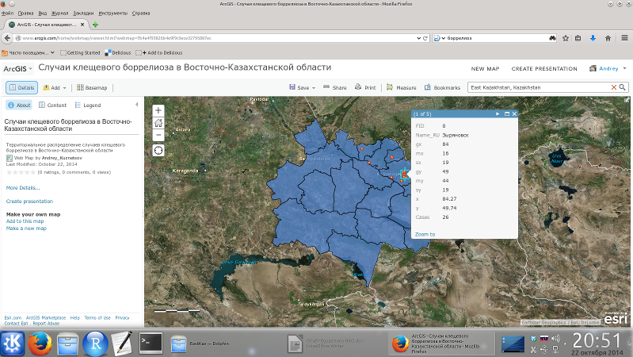

---

## GIS (Geographic Information Systems)

    

- Geographic Information Systems are  the single interacting complex of computer programs to store spatial and attributive data, their management, analysis, exchange and presentation in geographic context (mapping).
- The GIS properties are ideal for surveillance of infectious diseases, to control their distribution and to study outbreaks.

---

## Obtaining spatial data for input into GIS

    

The geographic coordinates for inclusion of them in spatial data can be obtained in geodetic surveys using a theodolite (the oldest way)...

---

## Obtaining spatial data for input into GIS

    

By investigation of geographical objects with known coordinates (digitization of old maps).

---

## Obtaining spatial data for input into GIS

    

Obtaining coordinates of known geographical objects (human settlements) is possible in the specialized sites, such as [LatLong] (http://www.latlong.net/) ...

---

## Obtaining spatial data for input into GIS

    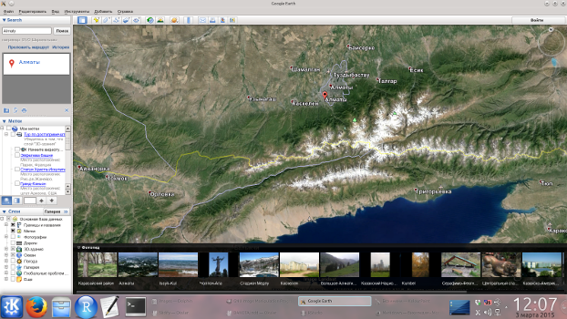

or in the program [Google Earth](https://www.google.com/earth/).

---

## Obtaining spatial data for input into GIS

    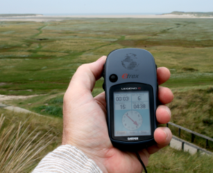

> * However, the most convenient way to get the coordinates of field objects during outbreak investigation, work in a natural foci of infection, carrying out epidemiological, epizootic, parasitological and other researches is use of the global positioning systems (GPS).
> * Field teams use GPS to get the spatial data and to construct the point layers of GIS.

--- bg:darkgrey

     
     
     
     
     
     
     
     
     
    
        A bit of theory
    

--- #blockquote

## The Global Positioning System: definition

> **The Global Positioning System** is a satellite navigation system providing measurement of distance, time and and defining location in the global coordinate system WGS 84. It allows to measure location and speed of objects in any place of Earth (excluding subpolar areas) almost under any weather conditions, and also in a near-earth space.

 
*The global coordinate system WGS 84 is used in projects of the free GIS, Quantum GIS.*

---

## GPS: technical aspects

    

---

## GPS: technical aspects

    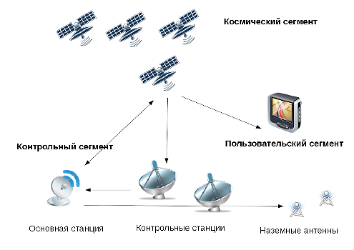

GPS consists of three main segments: space, control, and user. 
> - **Space segment** consists of the GPS satellites, which transmit radio signals from the space.
> - **Control segment** consists of a master station and several additional stations, ground antennas and control stations.
> - **User segment** consists of GPS receivers.

---

## Radar: measurement of distance between two points 

    

A radar transmits a short radio impulse of great power. This impulse is emitted in one direction depending on orientation of an antenna and spreads with the speed of light c0</ sub>.

If the direction of the impulse spread has an obstacle, radio wave disperses in all directions. A small portion of the impulse is reflected back to the radar.

---

## Radar: measurement of distance between two points

    

The return time of a radio wave t is proportional to a distance to an obstacle R, which can be calculated (in the elementary case) by formula:
$$
R = {{c_0 \times t} \over 2}
$$

It is an example of the linear coordinate of object measurement.

---

## GPS: calculation of three-dimensional coordinates

**Principle**: GPS satellites transmit a signal from space, and all GPS receivers use this signal for calculation of their location by three coordinates in real time.

For estimation of three-dimensional coordinates *x*, *y* and *z* the GPS receiver need to have the solved equation "distance are equal to the product of speed of light and a difference of the user's signal reception moments and the moment of its synchronous emission from satellites" for all *i* satellites:

$$
d_i = c_0 \times (t_{t,i} - t_{r,i}) + t_c = \sqrt{(x_i - x)^2 + (y_i - y)^2 + (z_i - z)^2}
$$

---

## GPS errors

    

Accuracy of estimation of an object location with GPS affect is influenced by [many factors](http://en.wikipedia.org/wiki/Error_analysis_for_the_Global_Positioning_System). For example, it can be atmospheric phenomena. The delay of the returned signal can be caused by action of a solar wind and the geomagnetic phenomena in the ionosphere. This delay can be up to 300 nanoseconds, which causes an error in determining the position of an object up to 100 meters (J. A. Klobuchar, 1981). In general the bias of time estimation of the returned signal are 10 nanoseconds (3 - 5 meters).

---

## GPS errors

    

GPS signals are distorted by:
> * Atmospheric phenomena;
> * Metal constructs;
> * Other solid formations (mountains, buildings and so on);
> * Electromagnetic fields .

---

## GPS errors

    

It is clear that any physical obstacle on the impulse way distorts the measurement's result.
Remember the following **rules**:
> 1. **"Clear sky"**: Use the GPS receivers in open space, far from buildings and trees.
> 2. Though for obtaining coordinates in GPS only 3 satellites there are enough, it is necessary to carry out location observation at connection **not less than to 4 satellites**.

---

## The global satellite navigation systems

> * USA – **Global Positioning System (GPS)**: 32 satellites;
> * Russian Federation - **Глобальная навигационная спутниковая система (ГЛОНАСС / GLONASS)**: 29 satellites;
> * EU - **Galileo**: 4 satгellites; it can work with GPS and GLONASS;
> * China - **Beidou**: 15 satellites.

--- bg:darkgrey

     
     
     
     
     
     
     
     
     
    
        The portable GPS receiver Garmin Dakota&#174; 20
    

---

## The Garmin Dakota 20 appearance

    

---

## Garmin Dakota: a power button

<table width="100%" cellpadding="0" cellspacing="0">
	<tr valign="top">
		<td width="50%" style="border: none; padding: 0cm">
			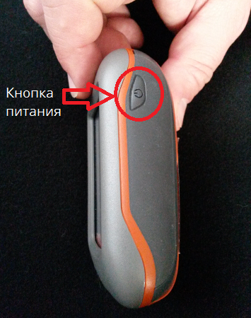
		</td>
		<td width="50%" style="border: none; padding: 0cm">
        <ul>
			<li><b>To turn on</b> the Dakota device push the power button;</li>
            <li><b>To turn off</b> the Dakota device push and  hold the power button;</li>
            <li><b>To block and to unblock</b> of a screen press and immediately turn loose the power button.</li>
        </ul>    
		</td>
	</tr.>
</table>

--- bg:darkgrey

     
     
     
     
     
     
     
     
     
    
        Connection of batteries
    

---

## Back surface of Garmin Dakota

    

---

## Connection of batteries

    

> * Shift a latch to uncover a batteries' compartment.
> * A device Garmin Dakota is powered by two batteries of type AA ("finger" batteries).
> * You can also use rechargeable NiMH battery.
> * Insert the batteries into the compartment combining + and - marks on the device and batteries.
> * Close the batteries compartment cover.
> * If you are not going to use the device for a long time (several months), remove the batteries. The data in the device will not be lost.

--- bg:darkgrey

     
     
     
     
     
     
     
     
     
    
        BaseCamp: before for the first time turning on the receiver
    

---

## Garmin Dakota: updating in the BaseCamp programme

<table width="100%" cellpadding="0" cellspacing="0">
    <tr valign="top">
		<td width="50%" style="border: none; padding: 0cm">
			
		</td>
		<td width="50%" style="border: none; padding: 0cm">
        <ul>
			<li>Prior to work with Garmin Dakota it is necessary to update device's firmware, used maps, and also additional software.</li>
            <li>Garmin Dakota connects with a computer with a cable with the USB interface. The user’s files can be recorded on this device. This device can be plugged as a flash drive.  (Build in memory is 850 МB; moreover, the additional flash card can be plugged and used).</li>
        </ul>    
		</td>
	</tr>
</table>

---

## Garmin Dakota: updating in the BaseCamp programme

> - Nevertheless, updating of the software on the device is carried out not by direct copying, but with the special programme, [**BaseCamp**](http://download.garmin.com/software/BaseCamp_446.exe) (before for this purpose the programme **MapSource** was used).
> - The Russian-language version of BaseCamp for the PC can be loaded through the link http://www8.garmin.com/support/download_details.jsp?id=4435
> - After loading of the file of the installer, start it and agree with modification of Windows.

---

## BaseCamp: steps of installation

---

## BaseCamp: steps of installation

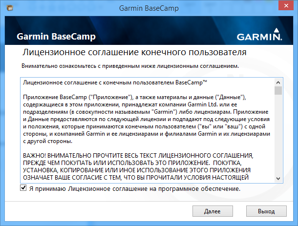

---

## BaseCamp: steps of installation

---

## BaseCamp: steps of installation

---

## BaseCamp: the first time launching

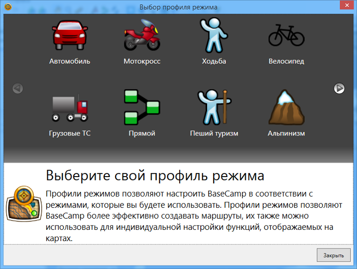

---

## BaseCamp: the first time launching

---

## BaseCamp: the first time launching

---

## BaseCamp: the training video

---

## BaseCamp: the training video

Click on the menu item makes transition to the page [Youtube](https://www.youtube.com/watch?v=X3fmNBCL9R4) with the training videos about work with the programme (in English).

---

## Garmin Dakota: updating in the BaseCamp programme

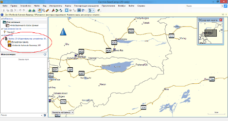

> - After the launching BaseCamp, do not close the programme and connect Garmin Dakota to a computer through  the  USB .
> - On the left, in the section "Devices", an identifier Garmin Dakota 20 and also icons for access to its internal memory and preinstalled based map wil be appeared.

---

## Garmin Dakota: updating in the BaseCamp programme

Click the right mouse button on the icon of preinstalled maps and select in the context menu *"Check for software updates: Dakota 20"*.

---

## Garmin Dakota: updating in the BaseCamp programme

---

## Garmin Dakota: updating in the BaseCamp programme

---

## Garmin Dakota: updating in the BaseCamp programme

---

## Garmin Dakota: updating in the BaseCamp programme

---

## Garmin Dakota: updating in the BaseCamp programme

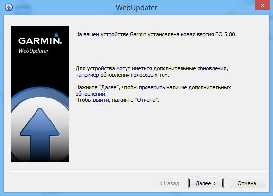

---

## Garmin Dakota: updating in the BaseCamp programme

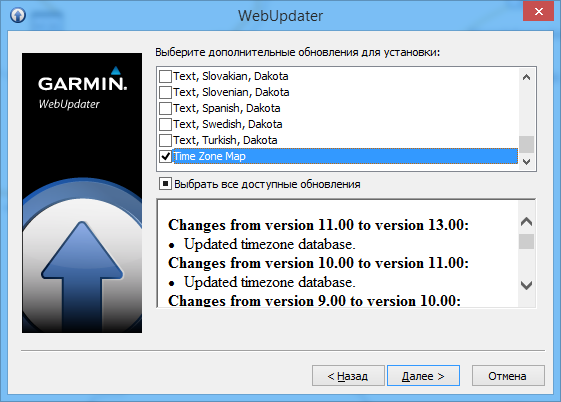

---

## Garmin Dakota: updating in the BaseCamp programme

---

## Garmin Dakota: loading of additional maps

<table width="100%" cellpadding="0" cellspacing="0">
    <tr valign="top">
    	<td width="50%" style="border: none; padding: 0cm">
        

			
        

		</td>
		<td width="50%" style="border: none; padding: 0cm">
        

             
        

		</td>
	</tr>
</table>

Unfortunately, the preinstalled map on the Garmin Dakota has a low level of details. This circumstance makes it inappropriate for epidemiological work and requires installation of the additional maps.

---

## Garmin Dakota: loading of additional maps

> - On [the site of the Garmin company](https://my.garmin.com/maps/nuMaps.htm) there's a number of maps both for purchase and for free loading (nüMaps).
> - Unfortunately, official maps of Kazakhstan are not present there. It demands loading maps of other producers on the device.

---

## Garmin Dakota: loading of additional maps

> - Maps for reseivers are distributed as \*.img files. 
> - The good source of Kazakhstan maps is the [Kazakhstan GPS club](http://www.gpsclub.kz/) (free registration is required).

---

## Garmin Dakota: loading of additional maps

> - At first \*.img map should be **installed on a computer**. After the Garmin receiver is connected to a computer this map should be installed on the receiver **by program BaseCamp**.
> - The commercial maps have also the installers which correctly register maps in the system for the BaseCamp programme can "see" them.
> - Freely distributed maps are presented only by the file \*.img, so they have to be installed on the computer by the programmes [MapSetToolKit](http://meridian.perm.ru/04_maps/gpsimg/bin/MapSetToolKit_v1.77.zip) and [cGPSmapper](http://meridian.perm.ru/04_maps/gpsimg/bin/cgpsmapperFree.zip).

---

## Garmin Dakota: loading of additional maps

*Lets install the free distributed map of Kazakhstan (based on OpenStreet Map) on the Garmin Dakota*.

> 1. The map can be downloaded at the [link](http://www.gpsvsem.ru/map.php?id=994) or you can find it in the catalog "Map" of the lecture material.
> 2. The program *MapSetToolKit* and *cGPSmapper* can be downloaded at the link on the previous slide, or you can find it in the folder "Software". These programmes do not require installation.
> 3. Before you start work, close the *BaseCamp* programme.

---

## Garmin Dakota: loading of additional maps

> - Run the programme *MapSetToolKit*.
> - Press a butom *"Select IMG"*  to choose  **folder** with a file \*.img of the necessary map. 

--- bg:red

     
     
     
     
     
     
     
     
     
    
        ATTENTION!  
        A name of the map should be in the format:   
        "eight any digits + file name extension"   
        (other files the programme doesn't see).   
        For example, the name of a map could be <i>12345678.img</i>.
    

---

## Garmin Dakota: loading of additional maps

- In the dialog box, select the right folder name.

---

## Garmin Dakota: loading of additional maps

- Choose with a mouse the name of map in the list *”Source IMG files"* and press the button *"Add"* to add the map into the list *"Selected IMG files"*.

---

## Garmin Dakota: loading of additional maps

> - On the computer it is possible to install not only one map but also the maps' set (mapset).
> - But even if one map is installed, it is called a "set".
> - Create a folder for the installation of a mapset. For example, *"Documents/Garmin/Kazakhstan"*.
> - Press the button *"..."* near the field *"Mapset directory"* to choose a map for installation.

---

## Garmin Dakota: loading of additional maps

- In the dialog box choose the catalog of installation.

---

## Garmin Dakota: loading of additional maps

> - In the drop-list *"CodePage"* select the value *"1251"*.
> - Press the button *"..."* near the field *"TYP files"* to choose the auxiliary file \*.typ.

---

## Garmin Dakota: loading of additional maps

---

## Garmin Dakota: loading of additional maps

> - At installation of the card it is important to have only file \*.img. Files \*.typ can be absent. It does not interfere with installation of the map on the computer.
> - In case of absence of a file \*.typ, in the field *"Family ID"* (the identifier of a family) we input any number. It has to be unique among all sets of maps installed on your computer (all of them are visible on the right in the table *"Mapset installed"* in the column *"FID"*).
> - If you use a file \*.typ, anyway in the field *"Family ID"* input any number (it will be changed then to another, taken from the file \*.typ).

---

## Garmin Dakota: loading of additional maps

- Press the bottom *"..."* near the field *"cgpsmapper/cpreview folder"* to choose the folder with the programme *"cGPSmapper"*.

---

## Garmin Dakota: loading of additional maps

- *Important!* Flag the checkbox *"Install in Mapsorce"* for the installed map will be "visible" in the programme *BaseCamp*.

---

## Garmin Dakota: loading of additional maps

    

> - Press the buttom *"START"* to install the map on a computer.
> - If you used the \*.typ file, a dialog box will appear suggesting to adjust a product code with that one of the TYP file. Accept this offer.
> - After appearance of several console (black) windows at the end there has to be a window with the message *"Convert completed"*. It means that the map is successfully installed on the computer.
> - Now you can install it on the receiver. Run the programme *BaseCamp* and connect the Garmin Dakota device through the USB port.

---

## Garmin Dakota: loading of additional maps

    

> - Choose the installed map in the drop-down list in the left part of the programme *BaseCamp*.
> - If this list is absent, click by the right mouse buttom and choose in the menu the item  *”Maps”*.

---

## Garmin Dakota: loading of additional maps

    

- Choose in the menu of the programme *BaseCamp* Maps - Install maps.

---

## Garmin Dakota: loading of additional maps

---

## Garmin Dakota: loading of additional maps

---

## Garmin Dakota: loading of additional maps

---

## Garmin Dakota: loading of additional maps

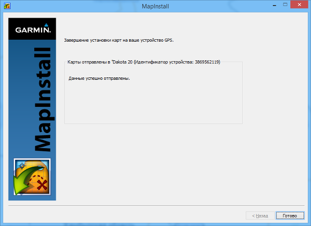

--- bg:darkgrey

     
     
     
     
     
     
     
     
     
    
        Field work with the Garmin Dakota&#174; 20
    

--- bg:lightblue

     
     
     
     
     
     
     
     
     
    
        Connection to satellites
    

--- &radio

## Check youself

With what number of satellites the Garmin Dakota device has to establish connection for correct estimation of geographical coordinates?

1. There is enough connection to one satellite;
2. To two;
3. To three;
4. _To four and more_.

*** .hint

It is necessary one satellite for each coordinate in three-dimensional space plus at least another one - for the correction of the coordinates.

*** .explanation

One satellite only allows you to estimate the distance between objects. Two satellites allow us to estimate the coordinates in two-dimensional space, three allow  do this in three-dimensional (x, y, z). However, as at scattering a signal from satellites with obstacles and the atmospheric phenomena, the error in estimation of coordinates arises, the larger number of satellites is necessary for correction of calculation. Therefore the correct answer is 4.

--- &radio

## Check youself

What influences quality of the signal received from satellites?

1. Mountains;
2. Power lines;
3. Buildings;
4. _All the mentioned_.

*** .hint

The signal delay is a cause of coordinate inaccuracy estimation.

*** .explanation

Quality of the signal received from satellites is influenced by the atmospheric phenomena, electromagnetic fields and any physical obstacles. Therefore the correct answer is 4.

---

## Garmin Dakota: connection to satellites

> - After turning on of the receiver on its display a welcome page appears, and then - the page of the main menu.
> - For possibility of a consistent reception of signals from satellites it is necessary to be far from high buildings, trees and power lines. Main rule of turning on of the receiver: **unobstructed vision of the sky**.
> - Turning on of the receiver indoors leads to waste of energy in the battery since the device in vain looks for satellites.

---

## Garmin Dakota: connection to satellites

For calculation of the current location the receiver during particular time has to collect necessary satellite data. Distinguish three modes of location estimation by the receiver: *cold*, *warm* and *hot* start.

> - At **cold start** the receiver has no information about the location, therefore searching of satellites takes long time — till 20 and more minutes depending on external conditions. Usually cold start is observed at the first turning on of the receiver or when moving on the considerable distance from a place of the previous switching on.
> - **Warm start** means that the reseiver kept in memory the almanac received at the previous switching on and also kept information about time, though with a small error. Time of the signal reception thus is reduced about several minutes.

---

## Garmin Dakota: connection to satellites

For calculation of the current location the receiver during particular time has to collect necessary satellite data. Distinguish three modes of location estimation by the receiver: *cold*, *warm* and *hot* start.

> - Finally, **hot start** — when the receiver was switched off quite recently and data of the almanac and ephemerises did not become outdated. Time of positioning can be reduced till 10–20 seconds.

---

## Garmin Dakota: connection to satellites

Turn on the device for the main menu appearance.

<table width="100%" cellpadding="0" cellspacing="0">
    <tr valign="top">
		<td width="50%" style="border: none; padding: 0cm">
			
		</td>
		<td width="50%" style="border: none; padding: 0cm">
        <ul>
			<li>In the bottom of the main menu there is an indicator of connection to satellites;</li>
            <li>In case of connection's absense strips of the indicator will be grey; the number of green strips indicates force of the connection;</li>
            <li>For appearance of the page of connection to satellites, press and hold about 2 seconds an indicator's icon.</li>
        </ul>    
		</td>
	</tr>
</table>

---

## Garmin Dakota: connection to satellites

<table width="100%" cellpadding="0" cellspacing="0">
    <tr valign="top">
    	<td width="50%" style="border: none; padding: 0cm">
			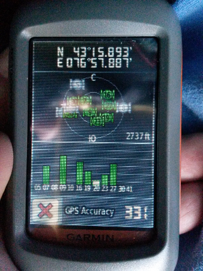
		</td>
		<td width="50%" style="border: none; padding: 0cm">
        <ul>
			<li>On the display of the receiver the arrangement of satellites concerning your current location will be schematically shown;</li>
            <li>The external circle corresponds to the line of the horizon, internal – to 45 degrees over the horizon;</li>
            <li>On the scheme numbers of satellites are also shown. The histogram in the bottom of the display shows the power of signals from each satellite recorded by the receiver.</li>
        </ul>    
		</td>
	</tr>
</table>

---

## Garmin Dakota: connection to satellites

    

--- bg:lightblue

     
     
     
     
     
     
     
     
     
    
        Setting of the Garmin Dakota&#174; 20
    

---

## Garmin Dakota: settings

    

In the main menu press the button *"Settings"* for pass to the page of settings of the device.

---

## Garmin Dakota: settings

<table width="100%" cellpadding="0" cellspacing="0">
    <tr valign="top">
        <td width="50%" style="border: none; padding: 0cm">
			
		</td>
		<td width="50%" style="border: none; padding: 0cm">
        <ul>
			<li>Buttons of the settings page of rovide access to many sections;</li>
            <li>We are interested only buttons <i>System</i>, <i>Display</i>, <i>Map</i> and <i>Units</i>;</li>
            <li>For access to the <i>Units</i> button, which is beyond the navigator's screen, use the "Arrow down" button.
</li>
        </ul>    
		</td>
	</tr>
</table>

---

## Garmin Dakota: settings

    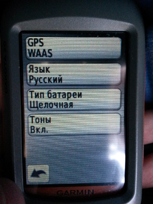

> - Press the button *"System"* to pass to setting of key parameters of the device.
> - Here only the GPS type demands setting. Press the top button of the page.

---

<table width="100%" cellpadding="0" cellspacing="0">
    <tr valign="top">
        <td width="50%" style="border: none; padding: 0cm">
    		
		</td>
		<td width="50%" style="border: none; padding: 0cm">
        <ul>
			<li>In the Garmin Dakota 20 there are 3 GPS types: normal, WAAS and demo mode.</li>
            <li>WAAS (wide area augmentation system) is the system of distribution of corrections to the data transferred by the GPS navigation system. Supplements GPS, increasing the accuracy of estimation of coordinates.</li>
            <li>The demo mode imitates GPS without real connection to satellites.</li>
        </ul>    
		</td>
	</tr>
</table>
 

Unfortunately, WAAS acts only on the territory of North America. Therefore we need to switch on the  **normal** GPS mode.

---

## Garmin Dakota: settings

    

> - Press the button *"Display"* on the page of the main menu to pass to setting of key parameters of graphic elements view on the device screen.
> - Here only calibration of the screen demands control. Press the lower button of the page.

---

## Garmin Dakota: settings

<table width="100%" cellpadding="0" cellspacing="0">
    <tr valign="top">
        <td width="50%" style="border: none; padding: 0cm">
        	
		</td>
		<td width="50%" style="border: none; padding: 0cm">
            
		</td>
	</tr>
</table>

> - In order that the receiver correctly reacted to pressing by a finger on the touch screen, it should be calibrated.
> - For this purpose it is necessary to touch consistently black points with a finger and to confirm the end of calibration.

---

## Garmin Dakota: settings

    

> - Press the button *"Map"* on the page of the main menu to pass to settings of the device's maps.
> - Here only display of the necessary maps on the device demands control. Press the lower button of the page.

---

## Garmin Dakota: settings

<table width="100%" cellpadding="0" cellspacing="0">
    <tr valign="top">
        <td width="50%" style="border: none; padding: 0cm">
            
		</td>
		<td width="50%" style="border: none; padding: 0cm">
            
		</td>
	</tr>
</table>

> - To tune up any map, it is necessary to press its button.
> - On the page of the map press the button *"i"* to see information about this map.
> - For deactivating of the map press the button *"Deactivate."*

---

## Garmin Dakota: settings

<table width="100%" cellpadding="0" cellspacing="0">
    <tr valign="top">
        <td width="50%" style="border: none; padding: 0cm">
            
    	</td>
		<td width="50%" style="border: none; padding: 0cm">
            
		</td>
	</tr>
</table>
 

On your Garmin Dakota device it is necessary to switch-off all maps, except earlier installed map of Kazakhstan.

---

## Garmin Dakota: settings

**Self-dependent work**

1. Turn on the Garmin Dakota device.
2. Go to the page of settings of the device, switch GPS in the mode *"Demo"*.
3. Return to the menu of settings, switch the device from the American units of measure to the metric.

 
<a class="btn btn-large btn-danger" rel="popover" data-content="In the main menu press the button <i>Settings</i>.   In the setting page press the button <i>Arrow down</i>.   Press the button <i>Units</i>.   Press in turn all the buttons and then the button <i>Меtric</i>." data-original-title="" id='example'>Press for hint </a>

--- bg:lightblue

     
     
     
     
     
     
     
     
     
    
        Reading the topographical information
    

---

## Garmin Dakota: waypoints

    

> - Locations or marks in the electronic map of the receiver which can be written down in memory of the device are called as **waypoints**.
> - Waypoints are used by drawing up routes, and also for rectilinear navigation in the mode **START** to the chosen waypoint.
> - Waypoints of the receiver can be exported as layers of GIS and become a basis for creation of spatial data.

---

## Garmin Dakota: waypoints

    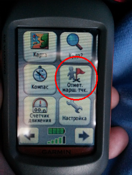

There are some methods of creation way or, in the terms of the Garmin Dakota, *route* points.

> - First, it is possible to press the button *"Mark a route point"* in the main menu of the navigator to write down the current position of the researcher as a route point (the most exact way).

---

## Garmin Dakota: waypoints

<table width="100%" cellpadding="0" cellspacing="0">
    <tr valign="top">
		<td width="33%" style="border: none; padding: 0cm">
			

		</td>
		<td width="33%" style="border: none; padding: 0cm">
			

		</td>
		<td width="33%" style="border: none; padding: 0cm">
			

		</td>
	</tr>
</table>

> - Secondly, irrespective of if a navigator is in the mode of reception of satellite signals 2D/3D or GPS is switched off, it is possible to create way (route) point by means of the map page. Being on the page of the map it is necessary, having touched with a finger the touch screen, to place the pointer in the form of a pin on an object / point for which it is necessary to create a route point. 
> - Near the name of an object (point) it is necessary to press the button with three strips for transition to the page of management of a route point.

---

## Garmin Dakota: waypoints

<table width="100%" cellpadding="0" cellspacing="0">
    <tr valign="top">
    	<td width="33%" style="border: none; padding: 0cm">
			

		</td>
		<td width="33%" style="border: none; padding: 0cm">
			

		</td>
		<td width="33%" style="border: none; padding: 0cm">
			

		</td>
	</tr>
</table>

> - It is possible to save a route point pressing the button with a flag.

---

## Garmin Dakota: waypoints

<table width="100%" cellpadding="0" cellspacing="0">
    <tr valign="top">
        <td width="33%" style="border: none; padding: 0cm">
			

		</td>
		<td width="33%" style="border: none; padding: 0cm">
			

		</td>
		<td width="33%" style="border: none; padding: 0cm">
			

		</td>
	</tr>
</table>
 

> - After creation of a waypoint it is possible to save it with parameters by default pressing the button *"Save"* or to change its name or other parameters pressing the button *"Save and edit"*. 
> - It is possible to accept changes pressing the button with a green tick.

---

## Garmin Dakota: waypoints

<table width="100%" cellpadding="0" cellspacing="0">
    <tr valign="top">
        <td width="33%" style="border: none; padding: 0cm">
    		

		</td>
		<td width="33%" style="border: none; padding: 0cm">
			

		</td>
		<td width="33%" style="border: none; padding: 0cm">
			

		</td>
	</tr>
</table>
 

> - Access to the waypoints created by the user can be got by means of the button *"Manager of route points"* of the main menu.
> - To get access to any waypoint is possible by clicking on the button with its name.

---

## Garmin Dakota: waypoints

<table width="100%" cellpadding="0" cellspacing="0">
    <tr valign="top">
        <td width="33%" style="border: none; padding: 0cm">
        	

		</td>
		<td width="33%" style="border: none; padding: 0cm">
			

		</td>
		<td width="33%" style="border: none; padding: 0cm">
			

		</td>
	</tr>
</table>
 

> - It is possible to edit properties of a waypoint by pressing the button with the image of a pencil on its page.
> - Including it is possible to remove a waypoint. To see the removal button, press twice the button *Arrow Down* on the page of the point.

---

## Garmin Dakota: routes and tracks

<table width="100%" cellpadding="0" cellspacing="0">
    <tr valign="top">
        <td width="33%" style="border: none; padding: 0cm">
            

		</td>
		<td width="33%" style="border: none; padding: 0cm">
			

		</td>
		<td width="33%" style="border: none; padding: 0cm">
			
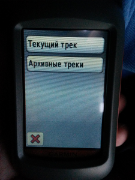

		</td>
	</tr>
</table>
 

> - **The route** represents sequence of several intermediate waypoints which will lead you to a terminal point of appointment. Points are connected by the line, the assumed direction of the movement.
> - The direction of movement (traveled distance) is called as **track**.

---

## Garmin Dakota: routes and tracks

<table width="100%" cellpadding="0" cellspacing="0">
    <tr valign="top">
        <td width="33%" style="border: none; padding: 0cm">
            

    	</td>
		<td width="33%" style="border: none; padding: 0cm">
			

		</td>
		<td width="33%" style="border: none; padding: 0cm">
			

		</td>
	</tr>
</table>
 

> - In memory the Garmin Dakota can store up to 200 tracks and up to 10 000 points of the traversed routes.
> - For access to the page of management of tracks it is necessary to press the button *"The manager of a track"* in the main menu.

---

## Garmin Dakota: routes and tracks

<table width="100%" cellpadding="0" cellspacing="0">
    <tr valign="top">
        <td width="33%" style="border: none; padding: 0cm">
            

        </td>
		<td width="33%" style="border: none; padding: 0cm">
			

		</td>
		<td width="33%" style="border: none; padding: 0cm">
			

		</td>
	</tr>
</table>
 

Creating and changing routes happens using  *"Route page"* (to access it you should press *“The routes planner"*.

--- bg:red

     
     
     
     
     
     
     
     
     
    
        ATTENTION!  
        Complete routes are more convenient to create on the computer   
        in the programme BaseCamp   
        (then you can export it to a device).  
    

--- bg:darkgrey

<a name='3'>

     
     
     
     
     
     
     
     
     
    
        Work with routes and tracks in BaseCamp
    

</a>

---

## BaseCamp: routes and tracks

---

## BaseCamp: routes and tracks

---

## BaseCamp: routes and tracks

---

## BaseCamp: routes and tracks

---

## BaseCamp: routes and tracks

--- bg:#CBE7A5

     
     
     
     
     
     
     
     
     
    
        In the subsequent the kml map can be seen in the Google Earth  
        or added in QuantumGIS as a point layer.  
        But it is another story…  
    

--- bg:lightblue

   <b>About author</b>  
   
     
  <b>Кuznetsov Andrey </b>  
   <i>Cand. Sci. Med., Senior Researcher of the brucellosis laboratory   
   of the  Kazakh Scientific Center of Quarantine and Zoonotic Diseases   
   <a href='mailto:linmedsoft@gmail.com'>linmedsoft@gmail.com</a>  
   <a href='mailto:akuznecov@kscqzd.kz'>akuznecov@kscqzd.kz</a>  
   <a href='https://www.linkedin.com/in/andreynkuznetsov'> LinkedIn</a>  
   <a href='http://www.researchgate.net/profile/Andrey_Kuznetsov11'> ResearchGate
</a>
   </i>

